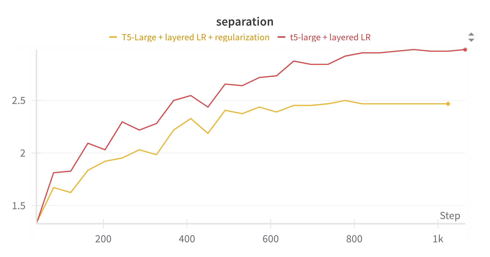
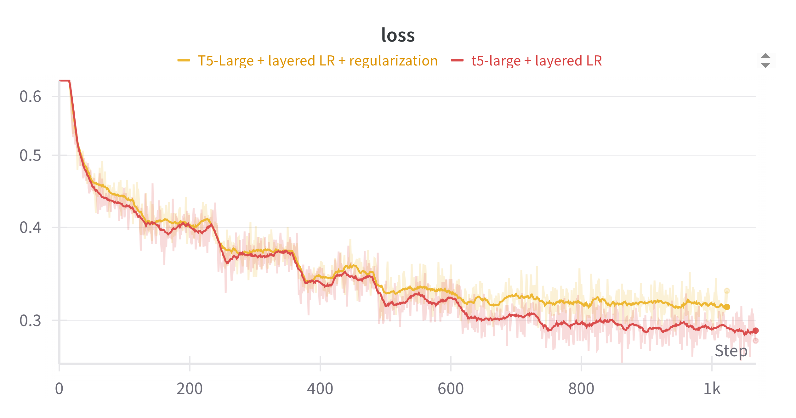
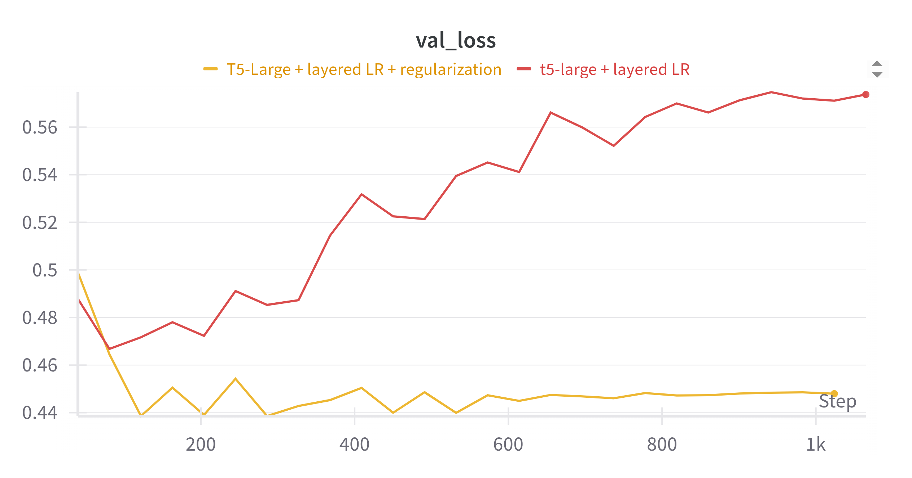

# Training a T5-Based Cross-Encoder for MS MARCO Passage

Much of the recent excitement in language models today has focused on generative / causal models. So much so that I recently trained my own [GPT-style model](github.com/jimsingh/llm_e2e) for fun. Google recently released [T5Gemma](https://developers.googleblog.com/en/t5gemma/) and I'm excited to see some 'attention' being given to encoder-decoder / seq-to-seq architectures.

In the past, we've seen that encoder heavy architectures such as BERT or T5 are more parameter efficient rankers versus decoder models. This is perhaps because these models use bidirectional attention and are trained for denoising through span corruption, so perhaps they understand query document pairs a bit better. I've also been impressed with the Gemma model releases and this project explores how T5Gemma could be finetuned for neural ranking. But first, I'll start using the existing T5 as the basis for a neural re-ranker.

## Background

The last time I looked at T5 it was the [RankT5 paper](https://arxiv.org/abs/2210.10634), which fine-tuned t5x to take the first token's hidden state from the encoder and passes it through a linear layer to compute relevance scores.

One gap that I noticed in the paper was that the loss function comparison was limited to pairwise and listwise. The quadratic nature of pairwise loss limits its scalability to longer result sets and the paper found that evaluating more results with a listwise loss function was superior to using pairwise loss on a smaller resultset.

My hypothesis is that for real world use cases we need to consider both top-5 result pairwise quality *and* listwise for the remainder. This could capture both aspects of ranking: precision at the top for question / answer and quality browsing lists for users that want to go deeper by exploring lower positions.

One criticism of this might be that users typically only click on the top results. My retort is that this is because the top results are infact the best and people are trained to stop looking after the first few results. But users are clearly scroll far beyond position 5 when they are in an exploratory mood (instagram, tiktok).

## Project Goals

- Finetune T5 to get close to the original paper's performance
- Train pairwise to start, then listwise, and then pairwise + listwise hybrid
- Evaluate MS MARCO passage ranking using standard IR metrics (MRR@10, NDCG@5)
- Evaluate performance on a combination of question answer and browsy queries 
- T5Gemma is a stretch goal once I understand how that model was trained

# Current Progress

## Representation Extraction 

I evaluated three approaches for caputring the T5 encoder's representational embeddings from the hidden layer. My eval strategy was fairly rough: compare the cosine similarity of positive and negative examples using each approach. The approach that had the lowest similarity would be a good starting point because the model had already learned some differentiation.

1) first token (RankT5's approach)
2) last token (likely more appropriate if there was a decoder)
3) mean pooling (use signal from the entire hidden state) 
3b) pooling with attention (use signal from the hidden state for tokens that matter the most)

In the end, 3b) significantly outperformed the other approaches. Cosine similarity was in the 0.9 range while other mechanisms barely differentiated between positive and negative examples (cosine similarity ~0.98).

### Learnings from Training (and fixes)

In my first training run
1. There was a growing diference between validation loss and training loss. (indicating overfit)
2. Separation continued to increase, likely pushing easy examples further apart, which would improve loss but probably not ranking outcomes.
3. It occured to me that using the same learning rate and decay for the entire model didn't intuitively feel like the right strategy. (the rankt5 paper uses a constant 1e-4 LR)
4. Observed a sawtooth loss pattern after the model completed an epoch (showing overfit)

I quickly did the following:
1. added tanh to the loss to cap the reward for separating easy examples (I also considered focal loss and mining for hard negatives, but this much more work)
2. added drop out 0.1 right before the final dense layer
3. used different LRs for embedings, encoder, and dense layers
4. decreased AdamW beta2 to 0.97 (down from the default of 0.999) because gradients were noisy and I didn't wanted the optimizer to forget the magnitude of older gradients.
5. shuffled far more of the dataset because I saw a saw tooth loss pattern
7. logged more data during training (separation, parameter drift by layer, lr decay -- at this point I was just trying to see what I could do with wandb)

### Training Results

The charts compare two configurations:
- **Red line**: T5-Large with differential learning rates only
- **Yellow line**: T5-Large with differential learning rates + regularization (dropout)


  


Looking at the validation loss chart, you can see the non-regularized model (red) starts overfitting with validation loss climbing from ~0.47 to ~0.57. The regularized model (yellow) keeps validation loss stable around 0.44-0.45. Both models get similar separation (2.5-3.0 range) but the regularized version is more stable.

The differential learning rates I used:
```python
embedding_lr = 5e-6    # conservative for delicate embeddings
encoder_lr = 5e-5      # moderate for pretrained encoder  
dense_lr = 2e-4        # aggressive for untrained dense layer
```

I left out many other trainig runs that were partial implementations of the above strategy! At this point, I felt I had a model that was worth considering for eval.

## Results!
### MS MARCO Passage Ranking (Dev Set)

Evaluation on MS MARCO passage dev/small (6,980 queries) with top-1000 BM25 candidates reranked to top-10.

| Model | MRR@10 | NDCG@5 | NDCG@10 | MAP |
|-------|--------|--------|---------|-----|
| BM25 Baseline | 0.1840 | 0.1974 | 0.2284 | 0.1926 |
| **This Run** | **0.3047** | **0.3269** | **0.3621** | **0.3116** |

**Improvement over BM25:** +65.6% MRR@10

As a point of reference, early BERT results were also in the 0.30 range. So for a first
pass using only pairwise loss without hard negative mining, this is a respectable result.

### Model Configuration

- **Base Model:** T5-Large (770M parameters)
- **Architecture:** Encoder-only with classification head
- **Training:** 50k steps, batch size 104, pairwise BCE loss with tanh capping
- **Input Format:** `"Query: {query} Document: {document}"`
- **Max Length:** 128 tokens
- **Reranking:** Top-1000 BM25 candidates → Top-10


### What's next?

- looking more closely at losses
- hard negative mining
- improved loss function, such as focal loss
- listwise and pairwise samples
- T5Gemma once I understand HOW it was trained better - it seems to have transferred weights from GemmaV2

## Methodology

- build a straightforward framework to eval ranking tasks (trec_eval, ranx, pyserini)
- use BM25 based retrieval and a (very) low quality TF-IDF ranker
- substitute TF-iDF with neural ranking starting with off the shelf models
- finetune T5X and T5Gemma for ranking
- evaluate using standard IR metrics
- examine results qualitatively
